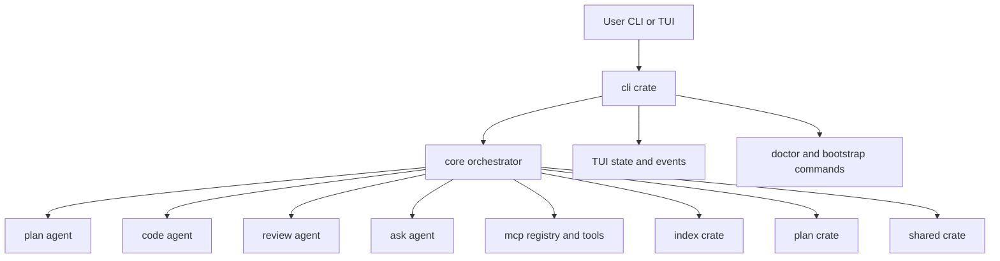

# Plan: Telisq v1 Implementation Master
> Feature: full implementation from PRD v2.0 with pragmatic baseline
> Created: 2026-04-01
> Status: completed

## Scope Lock

- Source document: `telisq-PRD.md`
- Baseline selected: include high-value suggestions only
  - include `telisq bootstrap`
  - include test-aware Code Agent behavior
  - include stronger model option for Orchestrator
- Deferred: other suggestion items and unresolved product decisions not required for first executable release

## Architecture Map

## Implementation File Plans

- [`plans/01-shared-plan-engine.md`](plans/01-shared-plan-engine.md)
- [`plans/02-mcp-llm-index.md`](plans/02-mcp-llm-index.md)
- [`plans/03-agents-orchestrator.md`](plans/03-agents-orchestrator.md)
- [`plans/04-cli-tui-sessions.md`](plans/04-cli-tui-sessions.md)
- [`plans/05-testing-release.md`](plans/05-testing-release.md)

## Global Sequence

1. Implement domain contracts and parser guarantees first.
2. Build infrastructure connectivity next: MCP, LLM, indexing.
3. Build agent execution lifecycle on top of stable contracts.
4. Integrate CLI, TUI, sessions, and user interaction loop.
5. Close with test matrix, reliability hardening, and release readiness.

## Exit Criteria

- `telisq doctor` validates env, services, MCP availability, and LLM connectivity.
- `telisq plan`, `telisq run`, `telisq index`, `telisq sessions`, `telisq session resume` execute end-to-end.
- Plan marker updates are atomic and dependency-safe.
- Orchestrator completes full lifecycle: plan generation, task execution, review, resume support.
- Integration tests pass with mocked services and optional real-service suite.

